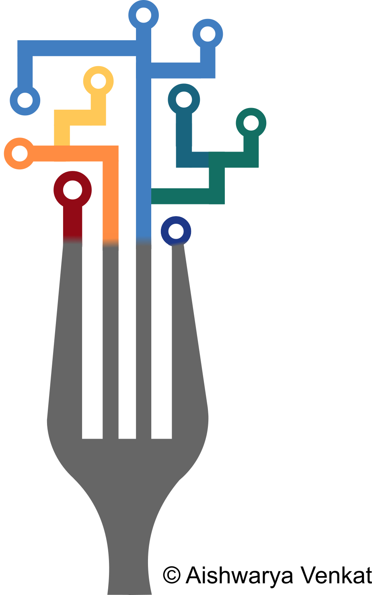

I am a self-taught graphic designer, and have recently expanded this interest into built objects through lasercut materials. Below are some of the works I have created.

# 3D Models

# Logos
<figure>
    
    <figcaption>Tufts chapter of the American Statistical Association</figcaption>
</figure>

<figure>
    
    <figcaption>Tufts Nutrition Data Conference 2018</figcaption>
</figure>
